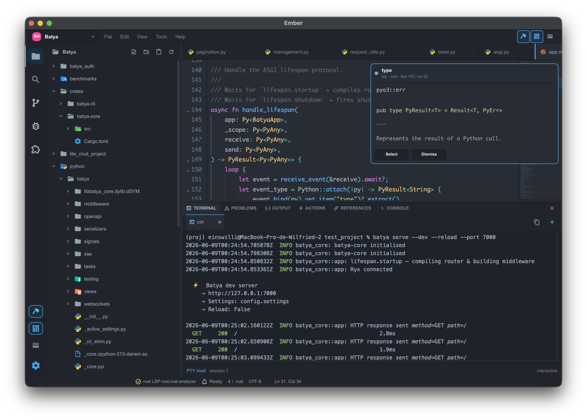

<a id="readme-top"></a>

<p align="center">
  
</p>

<h1 align="center">Ember</h1>

<p align="center">
  <strong>A personal code editor project, rebuilt with a modern workbench and plugin-first architecture.</strong>
  <br />
  Modern UI, native tooling, plugin-first architecture, and developer features that stay practical.
</p>

<p align="center">
  
  
  
  
  <a href="https://discord.com/invite/umDhd5HWgS">
    
  </a>
</p>

---

## Preview


<p align="center">
  
</p>


## What is Ember?

Ember is a modern code editor built as a personal project. It is designed as a general-purpose editor with a focused workbench, strong extension points, and practical developer tooling.

Today, Ember is a general-purpose editor focused on:

- a clean, modern workbench;
- a custom code editor with syntax highlighting, diagnostics, suggestions and navigation;
- Rust-powered tooling where performance matters;
- plugins as the default way to extend or replace features;
- local-first workflows, with AI integration planned around the editor rather than bolted on top.

It is still evolving quickly. The current direction is pragmatic: keep what works, remove what is legacy, and rebuild the core around a flexible architecture.

## Highlights

- **Custom editor UI** — token-based rendering, diagnostics, hover details, quick fixes, minimap indicators, folding and navigation.
- **LSP integration** — language providers are plugin-friendly, with Python/Rust support being actively wired through external LSP processes.
- **Rust acceleration** — Ferrite powers syntax/token work and native editor services are being expanded progressively.
- **Plugin system** — themes, icons, fonts, panels, shortcuts, search providers, formatters and diagnostics can be contributed by plugins.
- **Themeable workbench** — appearance providers can control colors, editor tokens, file icons and fonts through explicit contracts.
- **Integrated terminal** — PTY-based terminal with themed rendering and workbench dock integration.
- **Project sessions** — project switching, editor tabs, recents and workspace-scoped state.
- **Ryx data layer** — project/session/settings storage is moving through Ryx, a Rust/sqlx-powered async ORM.

## Architecture

Ember is being rebuilt around clear layers:

```text
QML Workbench
  └─ ViewModels (PySide6 QObjects)
      └─ Async Services
          ├─ Ryx data models
          ├─ LSP / diagnostics / search / terminal services
          ├─ Plugin manager and contribution registry
          └─ Ferrite native Rust module
```

The old codebase is intentionally not treated as sacred. Ember keeps the lessons from the previous experiment, but the implementation is being modernized feature by feature.

## Built-in plugin examples

Ember already ships with internal/proprietary-style plugins that define core behavior:

- `emberDefaultTheme` — default workbench theme and editor token colors.
- `emberLightTheme` / `emberOneDarkTheme` — alternative appearance providers.
- `emberFileIcons` — file and folder icon provider.
- `emberFontPack` — editor/UI font provider.
- `emberDefaultKeybindings` — default keyboard shortcuts.
- `emberInlineDiagnostics` — inline diagnostic messages in the editor.
- `emberSearchRipgrep` — fast search provider.
- `emberPythonLsp` / `emberRustLsp` — language server providers.

The long-term rule is simple: most application features should be open to plugins, while the core backend remains stable and safe.

## Getting started

> Ember is in active development. Local dependencies such as Ryx, Batya and Falcorn may be used from sibling folders during development.

### Requirements

- Python `3.13+`
- `uv`
- Rust toolchain
- Qt/PySide6 runtime dependencies

### Run locally

```bash
uv sync
uv run maturin develop --release
uv run python studio.py
```

If you already have the virtual environment ready:

```bash
python studio.py
```

### Useful development commands

```bash
uv run ruff check .
uv run ruff format .
uv run pytest
```

<!-- ## Screenshots

Place current screenshots in:

```text
assets/screenshots/
```

Recommended names:

- `ember-workbench.png` — main editor/workbench screenshot used at the top of this README.
- `ember-settings.png` — settings and appearance providers.
- `ember-plugins.png` — plugin manager/store.
- `ember-terminal.png` — terminal and bottom dock. -->

## Roadmap

- Finish editor polish: selection, folding, suggestions, quick fixes, references and definitions.
- Finalize plugin contracts for panels, actions, LSP providers, themes, icons, fonts and file operations.
- Complete settings coverage for editor, AI, LSP, terminal, plugins and appearance.
- Add AI features: inline suggestions, contextual chat, code actions and project-aware workflows.
- Improve packaging, docs and contributor onboarding.

## Community

This is still a personal project, but feedback, experiments and contributions are welcome.

- Discord: [Join us Ember community](https://discord.com/invite/umDhd5HWgS)
- Issues and ideas: use the GitHub repository discussions/issues when available.

## History

Ember exists because **KivymdStudio** existed first. The original project was a small homemade editor built quickly in 2019. It had rough edges, but it also had enough personality to be worth reviving.

The new direction is not “KivyMD Studio v2”. It is **Ember**: a modern, extensible code editor that keeps the spirit of the original project while moving beyond its old scope.

<p align="right">
  <a href="#readme-top">Back to top ↑</a>
</p>
