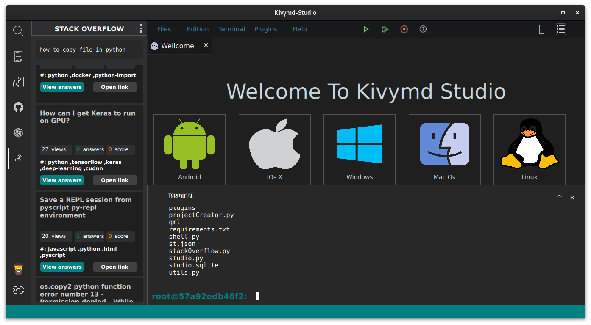
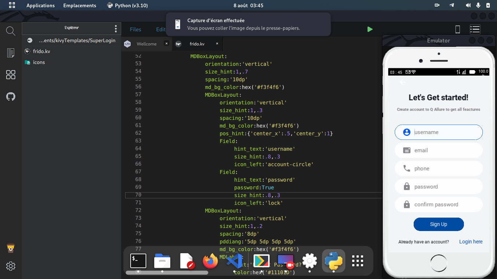

<a name="readme-top"></a>
<p align="center">
<br>
A kivyMD development studio
</p>

<p>This is not the official repository of KIVYMDSTUDIO. It is a small homemade project just for fun. This project was created during a short one-week break, so I didn't have enough time to adopt a well-defined structure for the project (everything was done in a hurry). I didn't expect this project to resonate with people, but I received emails containing both insults regarding the editor's malfunctions and words of encouragement.

I would like to thank all those who liked it and want to contribute, as well as those who sent me insults, as it made me realize the value they attach to this project...

Now, I will make improvements and dedicate at least three evenings out of seven to push bug fixes.</p>


## Project Demo
[Project Demo Video](Screenshots/kvscode_showcase.mp4)
<video width="320" height="240" controls>
    <source src="./Screenshots/kvscode_showcase.mp4" type="video/mp4">
    Votre navigateur ne prend pas en charge la balise vidéo.
</video>


## Prerequisites 
 - Python3.9
    - See [installation](#Installation) for OS specifics 
 

## Installation 
1. Install Python3.9
    - Debian, Ubuntu, Etc
        - `sudo apt-get install python3.9 python3-pip`
    - Fedora, Oracle, Red Hat, etc
        -  `su -c "yum install python3.9 python3-pip"`
    - Windows 
        - click [HERE](https://www.python.org/downloads/windows/) for downloads

2. Download and Extract the latest release from [HERE](https://github.com/Einswilli/KivymdStudio/archive/refs/heads/master.zip)

3. In the extracted folder, run these commands
    - `python install.py` <- install dependencies
    - `python studio.py` <-- start the script

## Screenshots


<!-- | <td colspan="2"></td> | -->

| | |
|---|---|
|||
|||
|||
|||
|||

<!-- <a href="https://github.com/Einswilli/KivymdStudio/tree/master/Screenshots/33.png?raw=true"> 
    
</a> -->

<!-- <a href="https://github.com/Einswilli/KivymdStudio/tree/master/Screenshots/32.png?raw=true"> 
    
</a>  -->

<!-- <a href="https://github.com/Einswilli/KivymdStudio/tree/master/Screenshots/26.png?raw=true"> 
     
</a>  -->

<!-- <a href="https://github.com/Einswilli/KivymdStudio/tree/master/Screenshots/27.png?raw=true">
  
</a> -->

<!-- <a href="https://github.com/Einswilli/KivymdStudio/tree/master/Screenshots/28.png?raw=true">
  
</a> -->

<!-- <a href="https://github.com/Einswilli/KivymdStudio/tree/master/Screenshots/20.png?raw=true">
  
</a> -->

<!-- <a href="https://github.com/Einswilli/KivymdStudio/tree/master/Screenshots/24.png?raw=true">
  
</a> -->

<!-- <a href="https://github.com/Einswilli/KivymdStudio/tree/master/Screenshots/21.png?raw=true">
  
</a> -->

 ## Quick Start

```qml
    #:import hex kivy.utils.get_color_from_hex

    <ButtonGris@Button>
        font_size: 25
        background_color:0,0,0,0
        canvas.before:
            Color:
                rgb: hex('#2e2b2b') if self.state =='normal' else (0,.7,.7,1)
            Ellipse:
                pos :self.pos
                size: 55,55

    <ButtonBlanc@Button>
        font_size:25
        background_color: 0,0,0,0
        color: hex('#000000')
        canvas.before:
            Color:
                rgb: hex('#ffffff') if self.state =='normal' else (0,.7,.7,1)
            Ellipse:
                pos: self.pos
                size: 55,55

    <ButtonOrange@Button>
        font_size:25
        background_color: 0,0,0,0
        canvas.before:
            Color:
                rgb: hex('#ffa20e') if self.state =='normal' else (0,.7,.7,1)
            Ellipse:
                pos: self.pos
                size: 55,55

    <ButtonRectangle@Button>
        font_size:25
        background_color: 0,0,0,0
        canvas.before:
            Color:
                rgb: hex('#2e2b2b') if self.state =='normal' else (0,.7,.7,1)
            RoundedRectangle:
                pos: self.pos
                size: 110,55
                radius: [25,]


    Calculatrice:
        id: calculatrice
        display: input
        orientation: 'vertical'


        GridLayout:
            orientation: 'lr-tb'
            size_hint: (1,0.3)
            cols: 1
            rows: 1
            TextInput:
                id: input
                background_color: hex('#000000')
                foreground_color: hex('#ffffff')
                font_size: 30
                justify: 'right'

        GridLayout:
            orientation: 'lr-tb'
            padding:'4dp'
            cols: 4

            ButtonBlanc:
                text: 'C'
                on_press: input.text =""

            ButtonBlanc:
                text: '+/-'
                on_press: input.text +='±'

            ButtonBlanc:
                text: '%'
                on_press: input.text +=self.text

            ButtonOrange:
                text: '/'
                on_press: input.text +=self.text

            ButtonGris:
                text: '7'
                on_press: input.text +=self.text

            ButtonGris:
                text: '8'
                on_press: input.text +=self.text

            ButtonGris:
                text: '9'
                on_press: input.text +=self.text

            ButtonOrange:
                text: '*'
                on_press: input.text +=self.text

            ButtonGris:
                text: '6'
                on_press: input.text +=self.text

            ButtonGris:
                text: '5'
                on_press: input.text +=self.text

            ButtonGris:
                text: '4'
                on_press: input.text +=self.text

            ButtonOrange:
                text: '-'
                on_press: input.text +=self.text

            ButtonGris:
                text: '3'
                on_press: input.text +=self.text

            ButtonGris:
                text: '2'
                on_press: input.text +=self.text

            ButtonGris:
                text: '1'
                on_press: input.text +=self.text

            ButtonOrange:
                text: '+'
                on_press: input.text +=self.text

            ButtonRectangle:
                text: '0'
                on_press: input.text +=self.text
            Label

            ButtonGris:
                text: '.'
                on_press: input.text +=self.text

            ButtonOrange:
                text: '='
                on_press: input.text=str(eval(input.text))
```


<p align="right" style="font-size: 14px; color: #555; margin-top: 20px;">
    <a href="#readme-top" style="text-decoration: none; color: #007bff; font-weight: bold;">
        ↑ Back to Top ↑
    </a>
</p>

## NOTE

In this update i wanted to give the possibility to contributors to be able to create plugins and install them directly in Kivymd Studio...
The problem with the launch of the studio under windows is fixed in this update...
But the emulator does not work very well under windows for the moment.I will fix it in the next version of the emulator.


<p align="right" style="font-size: 14px; color: #555; margin-top: 20px;">
    <a href="#readme-top" style="text-decoration: none; color: #007bff; font-weight: bold;">
        ↑ Back to Top ↑
    </a>
</p>


## To do list

    - [x] File Explorer (TreeView) (done)
    - [x] Project creator(done)
    - [x] Auto Completion in CodeEditor(done)
    - [x] Auto Indentation in OdeEditor(done)
    - [x] Syntax Highlight in CodeEditor(done)
    - [ ] General Project Search 
    - [x] Custom Terminal (done)
    - [x] Emmulator (done)
    - [x] Stack Overflow integration(done)
    - [ ] Settings
    - [x] MDIcons Picker (done)
    - [x] Color Picker 
    - [ ] PyLint integration
    - [ ] Git Integration
    - [ ] Plugin Manager
    - [ ] Theme Manager
    - [ ] Project Deps Manager (Integration with pip)
    - [ ] Virtualenv Manager

<!-- ## Showcase -->
<!-- <video width="320" height="240" controls>
  <source src="Screenshots/kvscode_showcase.mp4" type="video/mp4">
  Votre navigateur ne prend pas en charge la balise vidéo.
</video> -->
<!--  -->


## Next
    
    - Chat with GPT 4 (User must use his own Openai APIKEY)
    - General Project Search
    - Settings
    

## Bugs

    - Emulator can't load Python file correctly yet

## Contribution

 I am thrilled that you are considering contributing to our project! Here is some information to help you get started.

### How to Contribute

1. Clone this repository to your local machine.
2. Create a branch for your changes: git checkout -b your-branch-name.
3. Make the desired changes in the code.
4. Thoroughly test your modifications.
5. Submit your changes:
   - Add the modified files: git add .
   - Commit your changes: git commit -m "Description of your modifications"
   - Push your changes to your branch: git push origin your-branch-name
6. Open a pull request to the main branch of the repository.

### Contribution Guidelines

- Make sure to follow coding best practices and maintain consistency with the existing code.
- Document new features or modifications in the code.
- Thoroughly test your modifications and ensure they do not introduce any regressions.
- Respect the project's code of conduct and treat other contributors with respect and courtesy.

### Issues and Feature Requests

If you encounter an issue or have an idea for a new feature, feel free to open an issue in this repository. We are always open to suggestions and will do our best to address them promptly.

We greatly appreciate all contributions, and thank you in advance for your participation in the project!


<p align="right" style="font-size: 14px; color: #555; margin-top: 20px;">
    <a href="#readme-top" style="text-decoration: none; color: #007bff; font-weight: bold;">
        ↑ Back to Top ↑
    </a>
</p>


## Donate

Kvs Code (Kivymd Studio Code) is a free and open source project, and will remain as one. If you would like to provide financial support, you can use the following links. This is completely optional, but every contribution is much appreciated!

<!-- [](https://paypal.me/MatyasMustoha) -->
[](https://liberapay.com/einswilli/donate)
[](https://www.patreon.com/user?u=54110867)
[](https://www.buymeacoffee.com/einswilligK)


<p align="center">Made with ❤️ By #Einswilli</p>
<p align="center" style="font-size: 8px">v1.1.1</p>
